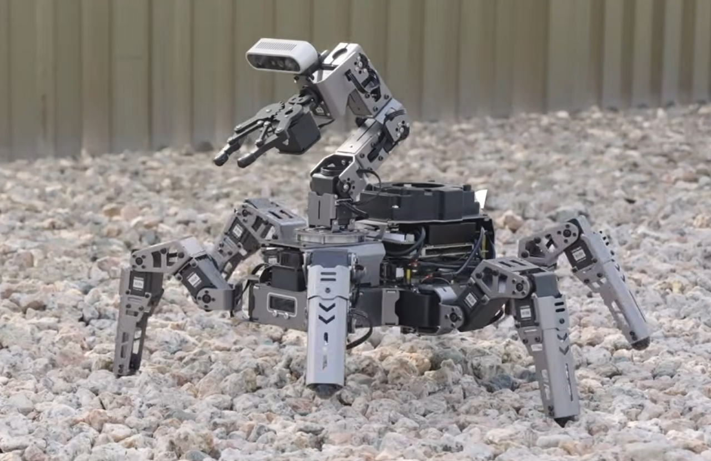
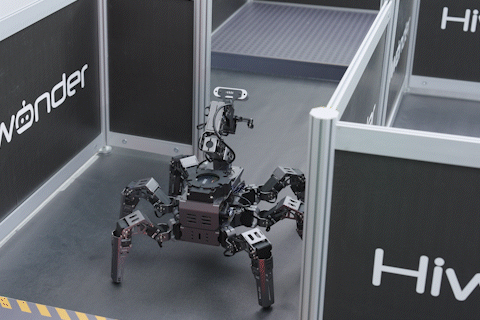
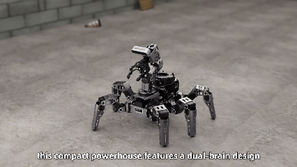
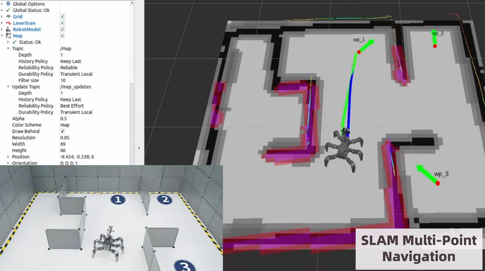

# ROSpider

English | [中文](README_cn.md)

<p align="center">
  ROSpider is our ROS2-based hexapod robot platform built for intelligent locomotion, AI vision, SLAM, autonomous navigation, and multi-robot experimentation on Jetson.
</p>

<p align="center">
  
</p>

## Product Overview

### About ROSpider

ROSpider is our open-source hexapod robot platform built on ROS2 and designed for developers, educators, makers, and robotics learners who want more than a basic walking demo. It brings together motion control, perception, mapping, navigation, voice interaction, and application-level ROS workflows in one integrated workspace, so you can move from hardware bringup to advanced autonomous behaviors with far less setup effort.

We built ROSpider to solve a common problem in legged robotics: many projects can demonstrate motion, and many others can demonstrate perception, but very few connect the full chain from low-level servo control to practical ROS applications on real hardware. ROSpider closes that gap by providing a ready-to-extend software stack for a real six-legged robot platform.

<p align="center">
  
</p>

Whether you are teaching robotics, prototyping interactive AI applications, or exploring how locomotion and perception work together on Jetson-based hardware, ROSpider provides a complete and approachable foundation.

### The Core: A Hexapod Platform Designed for Real Deployment

ROSpider is built around a six-legged robot architecture with **18 bus servos** for the legs and an additional **camera pan joint**, giving the platform both expressive body motion and active visual tracking capability.

**Full-body motion control**: The `rospider_controller` package integrates inverse kinematics, joint control, built-in poses, action-set execution, gait generation, and velocity-based motion control. It supports body translation and rotation transforms, head yaw control, and raw odometry publishing for higher-level ROS integration.

**Rich onboard hardware integration**: Our base bringup stack launches robot description, joystick control, RGB lighting, IMU, camera, LiDAR, OLED display, and the main control node together, providing a practical starting point for real robot deployment instead of an isolated algorithm demo.

**Jetson-oriented design**: Multiple packages use `Jetson.GPIO`, and the environment scripts are configured around **ROS Melodic** workspaces on Jetson-class devices. This makes ROSpider especially well suited for Jetson-based educational and intelligent robotics applications.

<p align="center">
  
</p>

### The Software Stack: Motion, Vision, SLAM, and Interaction

ROSpider is designed as a complete ROS application platform rather than a single-purpose repository.

**AI vision applications**: `rospider_app` and `rospider_tutorial` include object tracking, color tracking, AprilTag tracking, line following, hand gesture interaction, AR demos, face-related demos, pose-related demos, KCF tracking, and MediaPipe-based interaction examples.

**Self-balancing and reactive behaviors**: The application layer includes IMU-driven self-balancing with PID control, along with reactive behaviors such as line following and object tracking that directly connect visual perception to robot movement.

**SLAM and navigation**: `rospider_slam` supports multiple mapping backends including **GMapping**, **Karto**, **Hector**, and **Cartographer**. `rospider_navigation` adds map loading, AMCL localization, move_base integration, and multi-point navigation support.

**Offline voice interaction**: The `xf_mic_asr_offline` package enables offline speech interaction and voice-controlled robot behaviors, including motion, color-based tasks, and navigation-related workflows.

**Multi-robot capability**: `rospider_multi` provides formation and coordinated navigation launch files, giving ROSpider room to grow beyond a single robot into classroom demos, formation experiments, and multi-robot research projects.

<p align="center">
  
</p>

### Built for Learning, Expansion, and Creative Development

ROSpider is not just a product platform. It is also a development and teaching platform.

**Comprehensive tutorials**: `rospider_tutorial` includes a wide range of example scripts and launch files covering servo control, board-level IO, basic gait control, inverse kinematics, OpenCV projects, AR demos, deep learning demos, and creative interaction examples.

**Modular ROS package layout**: Core functions are split into bringup, controller, SDK, peripherals, interfaces, navigation, SLAM, applications, tutorials, and bundled third-party dependencies, making it easier to understand, customize, and extend the system.

**Practical engineering workflow**: The included environment scripts already define robot naming, master naming, LiDAR type, camera type, and ROS networking parameters, helping you start from a working robot workflow instead of rebuilding infrastructure from scratch.

## Official Resources

### Official Hiwonder

- **Official Website**: [https://www.hiwonder.com/](https://www.hiwonder.com/)
- **Product Page**: [https://www.hiwonder.com/products/rospider](https://www.hiwonder.com/products/rospider)
- **Official Documentation**: [https://docs.hiwonder.com/en/latest/jetson/](https://docs.hiwonder.com/en/latest/jetson/)
- **Technical Support**: support@hiwonder.com

## Getting Started

### Recommended Environment

- Ubuntu 18.04
- ROS Melodic
- Python 3
- Jetson-based controller board
- ROSpider hardware with LiDAR, RGB camera, IMU, and serial bus servos

### Installation

1. Clone the repository as a catkin workspace:

```bash
git clone https://github.com/hiwonder/ROSPider.git ~/rospider
cd ~/rospider
```

2. Install ROS dependencies:

```bash
rosdep install --from-paths src --ignore-src -r -y
```

3. Build the workspace:

```bash
catkin_make
source devel/setup.bash
```

4. If you are using the official system image, you can also load the preset environment:

```bash
source ~/.hiwonderrc
```

This script sets `ROBOT_NAME`, `MASTER_NAME`, `LIDAR_TYPE`, `CAMERA_TYPE`, `ROS_HOSTNAME`, and `ROS_MASTER_URI`, then loads ROS Melodic and the ROSpider workspace environment.

### Typical Launch Commands

Bring up the base robot stack:

```bash
roslaunch rospider_bringup base.launch
```

Bring up the full app stack:

```bash
roslaunch rospider_bringup app_bringup.launch
```

Start SLAM:

```bash
roslaunch rospider_slam rospider_slam.launch slam_methods:=gmapping
```

Start map-based navigation:

```bash
roslaunch rospider_navigation rospider_navigation.launch map:=/path/to/map.yaml
```

Start a sample application:

```bash
roslaunch rospider_app object_tracking.launch
roslaunch rospider_app hand_gesture.launch
roslaunch rospider_app self_balancing.launch
```

Start multi-robot formation control:

```bash
roslaunch rospider_multi multi_formation/multi_formation.launch
```

## Repository Structure

```text
ROSpider/
└── src/
    ├── rospider_bringup/        # Base bringup, rosbridge, startup scripts
    ├── rospider_controller/     # Hexapod control, IK, gait, odometry, action sets
    ├── rospider_description/    # URDF/Xacro robot model and visualization assets
    ├── rospider_peripherals/    # Camera, LiDAR, IMU, OLED, joystick, RGB support
    ├── rospider_app/            # Object tracking, line following, self-balancing, gestures
    ├── rospider_navigation/     # AMCL, move_base, map loading, point publishing
    ├── rospider_slam/           # GMapping, Karto, Hector, Cartographer, RTAB-Map related launch
    ├── rospider_multi/          # Multi-robot formation and coordinated navigation
    ├── rospider_sdk/            # Hardware access helpers and robot SDK utilities
    ├── rospider_interfaces/     # ROS services and interfaces used by applications
    ├── rospider_tutorial/       # Example scripts and tutorial launch files
    ├── lab_config/              # LAB color-threshold configuration tools
    ├── dataset_capture/         # Dataset/image capture utilities
    ├── vision_utils/            # Shared vision helper functions
    ├── xf_mic_asr_offline/      # Offline speech recognition and voice control
    └── third_party/             # Bundled ROS dependencies and upstream packages
```

## Community & Support

- **GitHub Issues**: Report bugs and request features
- **Email Support**: support@hiwonder.com
- **Documentation**: Comprehensive guides and tutorials

## License

This project is open-source and available for educational and research purposes.

---

**Hiwonder** - Empowering Innovation in Robotics Education
